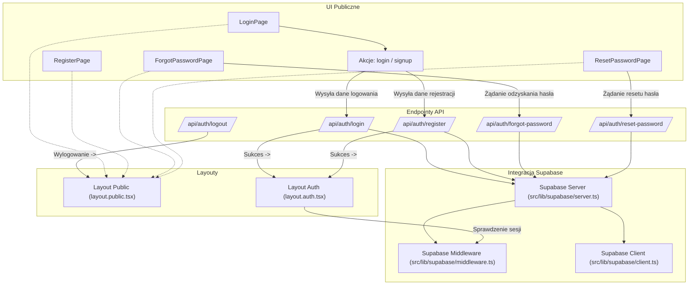

<architecture_analysis>
Analiza modułu autentykacji:
1. Komponenty UI:
   - LoginPage (src/app/login/page.tsx): Strona logowania zawierająca formularz z polami email i hasłem, wykorzystuje akcje `login` i `signup`.
   - RegisterPage (src/app/register/page.tsx): Strona rejestracji umożliwiająca tworzenie nowych kont (zgodnie z specyfikacją).
   - ForgotPasswordPage (src/app/forgot-password/page.tsx): Strona odzyskiwania hasła, gdzie użytkownik wprowadza swój email.
   - ResetPasswordPage (src/app/reset-password/page.tsx): Strona resetowania hasła po otrzymaniu tokenu z emaila.
   - Layout Public (layout.public.tsx): Layout dla stron dostępnych publicznie (bez autentykacji).
   - Layout Auth (layout.auth.tsx): Layout dla stron dostępnych po zalogowaniu, zarządzający dostępem do chronionych funkcji.

2. Endpointy API:
   - POST /api/auth/register: Rejestracja użytkownika.
   - POST /api/auth/login: Logowanie i tworzenie sesji.
   - POST /api/auth/logout: Wylogowywanie użytkownika.
   - POST /api/auth/forgot-password: Inicjacja procesu odzyskiwania hasła.
   - POST /api/auth/reset-password: Reset hasła przy użyciu tokenu.

3. Integracja Supabase:
   - src/lib/supabase/client.ts: Operacje autentykacji po stronie klienta.
   - src/lib/supabase/server.ts: Operacje autentykacji po stronie serwera.
   - src/lib/supabase/middleware.ts: Middleware zabezpieczające dostęp do stron chronionych.

4. Przepływ danych:
   - Użytkownik wprowadza dane w formularzach (LoginPage, RegisterPage, itp.).
   - Akcje (login, signup) wysyłają dane do odpowiednich endpointów API.
   - Endpointy komunikują się z modułem Supabase w celu weryfikacji danych i zarządzania sesją.
   - Middleware sprawdza stan sesji, przekierowując użytkownika do Layout Auth w przypadku sukcesu lub Layout Public w przypadku braku autentykacji.

5. Funkcjonalności:
   - Logowanie umożliwia użytkownikowi dostęp do aplikacji.
   - Rejestracja tworzy nowe konto użytkownika.
   - Odzyskiwanie i reset hasła umożliwiają przywrócenie dostępu do konta.
</architecture_analysis>

<mermaid_diagram>

</mermaid_diagram> 